# Procesverslag
Markdown is een simpele manier om HTML te schrijven.  
Markdown cheat cheet: [Hulp bij het schrijven van Markdown](https://github.com/adam-p/markdown-here/wiki/Markdown-Cheatsheet).

Nb. De standaardstructuur en de spartaanse opmaak van de README.md zijn helemaal prima. Het gaat om de inhoud van je procesverslag. Besteedt de tijd voor pracht en praal aan je website.

Nb. Door *open* toe te voegen aan een *details* element kun je deze standaard open zetten. Fijn om dat steeds voor de relevante stuk(ken) te doen.

## Jij

Uitwerken voor kick-off werkgroep

### Auteur:
Donna Schilperoort

#### Je startniveau:
Blauw 

#### Je focus:
Surface plane en misschien responsive 
 

## Je website

uitwerken voor kick-off werkgroep

### Je opdracht:
https://www.twentyonepilots.com/?frontpage=true

#### Screenshot(s) van de eerste pagina (small screen): 
Dit is de homepagina van Twenty one Pilots hun site  
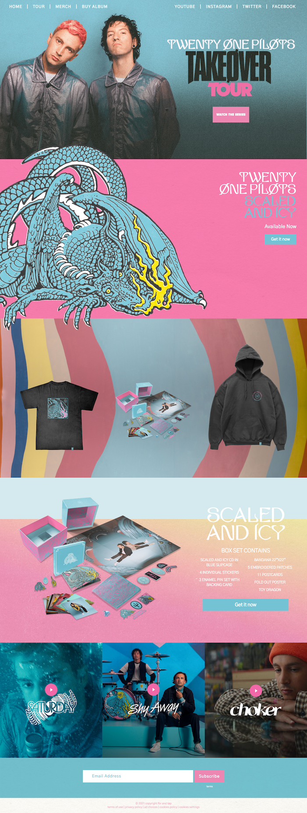

#### Screenshot(s) van de tweede pagina (small screen):
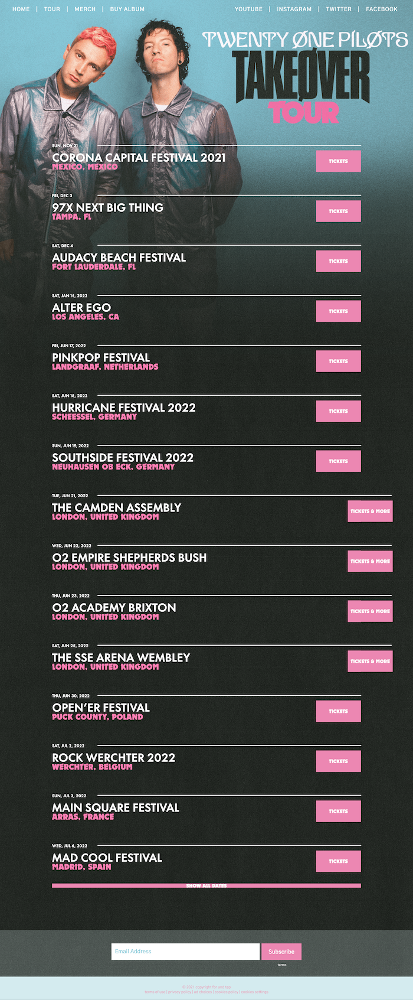
 

## Breakdownschets (week 1)

uitwerken na afloop 2e werkgroep

### de hele pagina: 
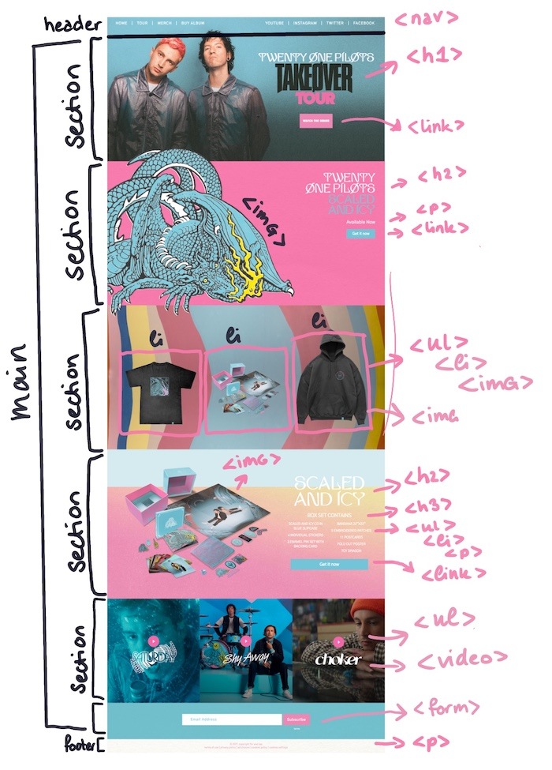

### dynamisch deel: 
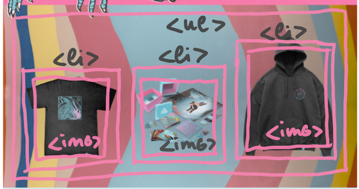

### wellicht nog een dynamisch deel: 
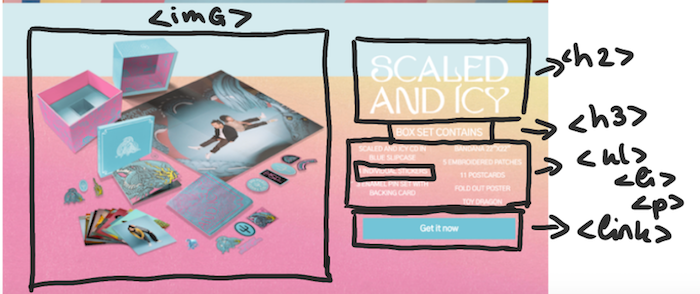

### de hele pagina: 

## Voortgang 1 (week 2)

Het werken aan de code gaat goed, ik heb alle html voor de eerste pagina uitgewerkt en ben begonnen aan de css

### Stand van zaken
Ik was per ongeluk begonnen de website vorm te geven voor dekstop formaat, waardoor ik een deel van mijn code opnieuw moest schrijven. 
Zo had ik al een navigatiebar gemaakt voor desktop en de achtergrond. 

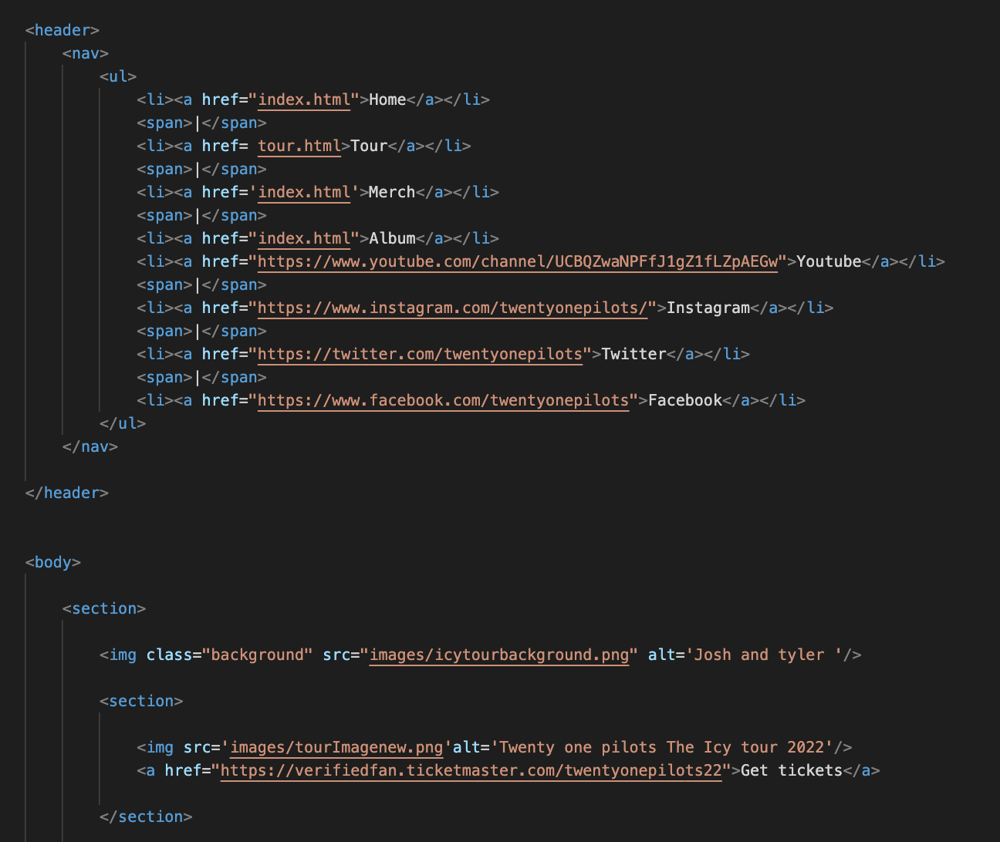

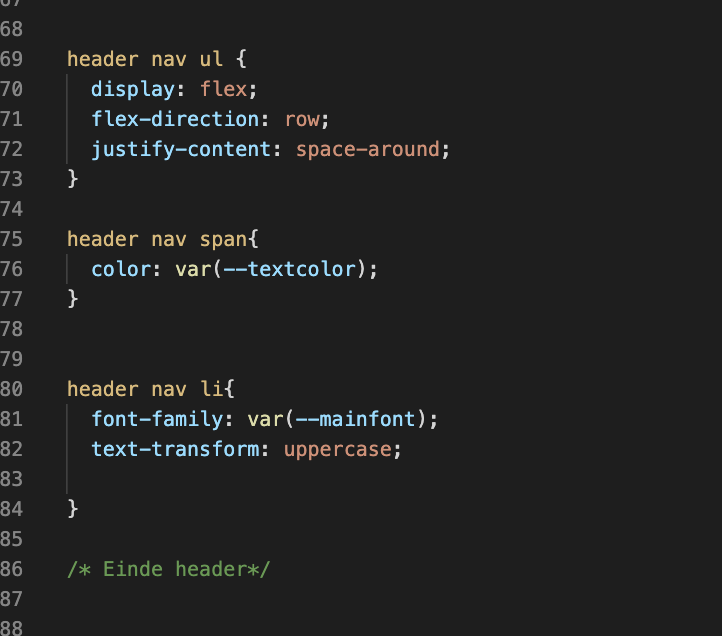

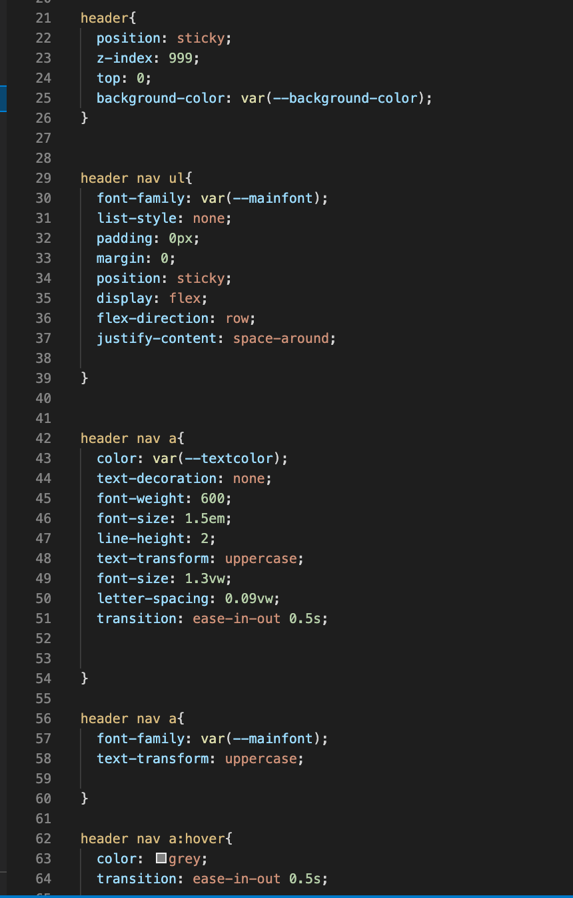

Ook had ik voor de H1 van mijn pagina een afbeelding gebruikt, terwijl dit beter een h1 kan zijn, waardoor ik dit ook nog moest aanpassen 

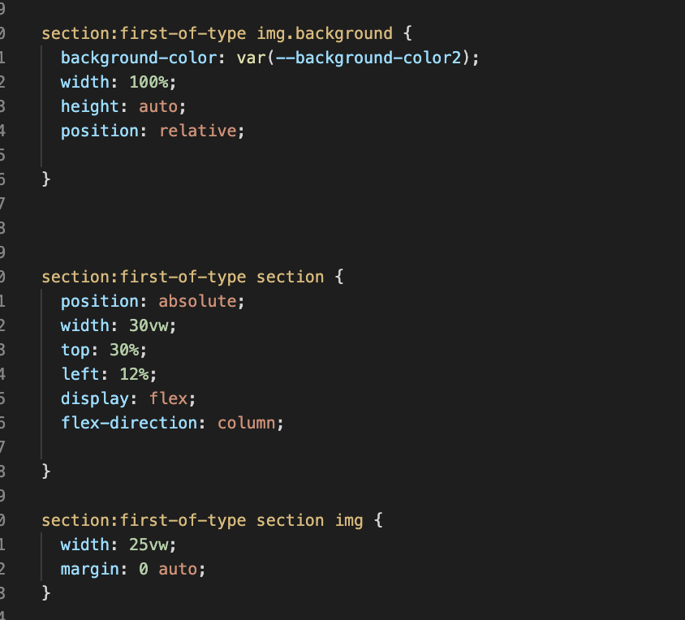

### Agenda voor meeting
samen met je groepje opstellen

| Angelo         | Maxime             | Rick         | Tatum            |
| ---            | ---                | ---          | ---              |
| Css werkt niet | Gaat goed          | loopt achter | Loopt achter     |
| op github      |                    | op het vak   | op het vak       |
| ...            | ...                | ...          | ...              |

### Verslag van meeting
hier na afloop snel de uitkomsten van de meeting vastleggen

- Ik moet gaan werken voor mobiel formaat 
- Als ik het nog responsive wil maken, kan ik later media queries gebruiken 

## Voortgang 2 (week 3)

Het schrijven van de code gaat goed, er zijn kleine dingen waar ik soms op vastloop maar geen extreme tegenvallers.

### Stand van zaken
Het grootste probleem waar ik op vastloop nu is het schrijven van de code voor de 2e html pagina en hoe ik dit moet aanspreken in de css 

zo neemt mijn formulier section de css over van een van de sections uit de homepagina, maar als ik daar last of type van maak doet de H1 ook gek

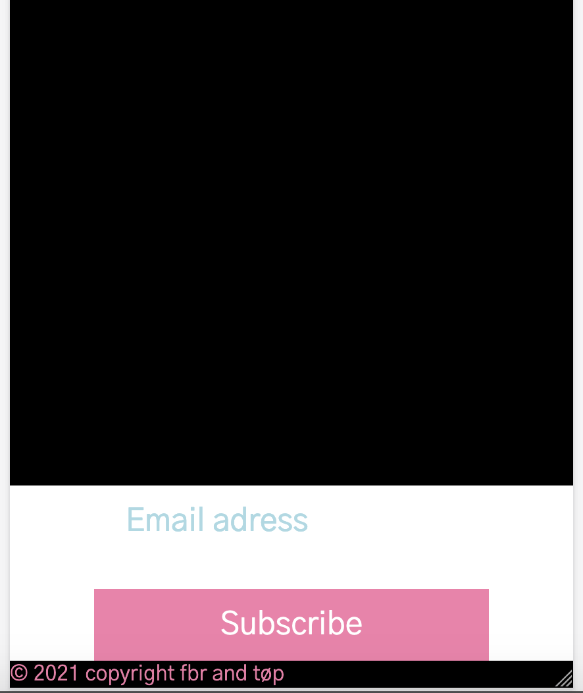

Ook loop ik nog een beetje vast met het maken van het hamburger menu, zo lukt het me niet helemaal de vormgeving daarvan goed te krijgen: 

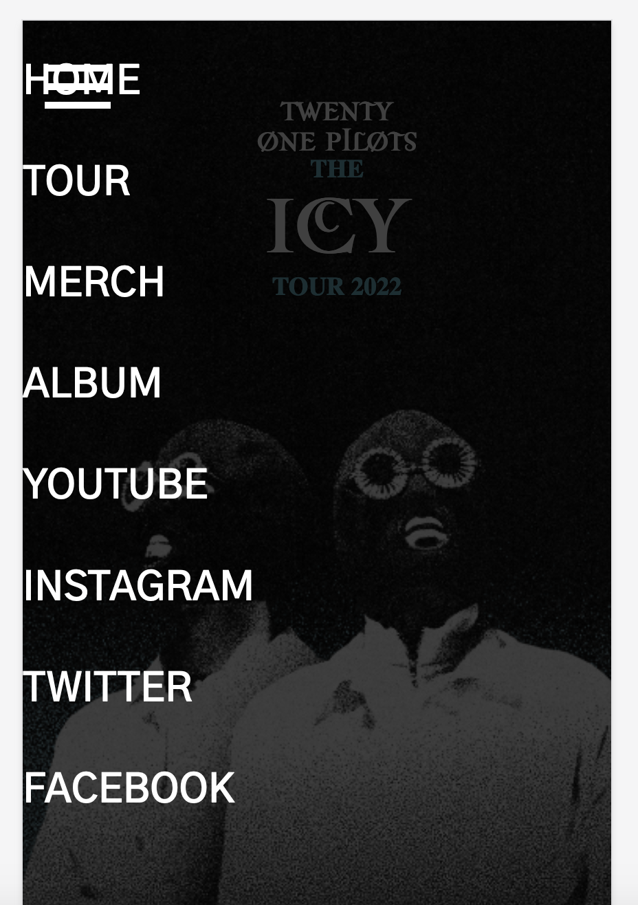

### Agenda voor meeting
samen met je groepje opstellen

| Angelo         | Maxime             | Rick         | Tatum            |
| ---            | ---                | ---          | ---              |
| 1 kopje lukt   | font pakt niet     | loopt achter | moet nog beginnen|
| niet           |                    | op het vak   | aan 2e pagina    |
| ...            | ...                | ...          | ...              |

### Verslag van meeting
hier na afloop snel de uitkomsten van de meeting vastleggen

- Omdat ik in de html van mn homepagina een section in een section had staan was dat ook de 'last of type' waardoor de h1 de vormgeving overnam van het formulier, deze section heb ik nu weggehaald 

- Ik sprak in mijn hamburger menu het verkeerde element aan in de css waardoor ik de list items niet goed kreeg 

## Toegankelijkheidstest (week 4)

De toegankelijkheidstest ging goed, ik vond het gebruiken van een screenreader daarentegen lastig, waardoor het soms met moeite ging

### Bevindingen
Lijst met je bevindingen die in de test naar voren kwamen:

#### Titel eerste bevinding
- In mijn eerste H1 bovenaan de pagina leest de screenreader ook ‘space’ voor, omdat er in mijn html spaties staan binnen de h1 elementen, als ik dit aanpas verandert de vormgeving ook: 

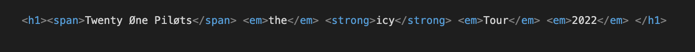

Door de spaties weg te halen in mijn html code 

#### Label formulier. 

Mijn formulier heeft nog geen label waardoor de screenreader niet een label heeft om voor te lezen

Dit kan opgelost worden door een < label > tag toe te voegen aan de pagina en deze vorm te geven. 

#### Focus state. 

Ik heb nog geen focus states en nog niet overal een hover 

Oplossing: Ik heb nu overal een duidelijke focus aan toegevoegd. 

#### Slider met afbeeldingen met een link erin. 

De screenreader leest nu de alt-text voor van de afbeelding, dan de alt-text voor de svg die op het plaatje staat en dan de link naar het nummer, waardoor het niet helemaal duidelijk is 

Oplossing: 
De complete Li met de 2 afbeeldingen en link erin kunnen in een < a > tag worden gezegd en als je daar dan de alt text: klik op deze link om het "het nummer" op youtube te luisteren is het wel duidelijk. 

#### Alt text afbeeldingen merch. 
De lijst met 3 afbeeldingen van de Merch moet nog een goede alt text krijgen, ik had nu 3x dezelde text 

Oplossing: 

#### bevindingen low contrast bril. 

De footer is lastig om te lezen, 
De lijst met dingen uit de box-set is lastig om te lezen door de witte text 

oplossing: footer text groter maken

#### bevindingen Bril met vlekkerig zicht. 

De website was verder goed en duidelijk te lezen 

#### Kleurenblindheids test 
Ik heb mijn website door Maxime uit onze klas laten bekijken die kleurenblind is en moeite heeft met bijv. de kleur blauw en paar, aangezien ik veel blauw en roze in mijn site heb vond ik het interessant haar mijn website te laten bekijken. Zij kon zonder moeite mijn website gebruiken. 

Ook heb ik de kleurenblindheidstest gedaan met Sim Daltonism dit zijn screenshots daarvan: 

## Voortgang 3 (week 4)

Ik loop goed op schema, ik moet alleen overal nog een duidelijke focus state toevoegen en ik wil misschien nog wat animaties toevoegen

### Stand van zaken
Ik ben erg blij met hem hamburgermenu dit ik nu heb gemaakt: 

### Agenda voor meeting

samen met je groepje opstellen

| Angelo         | Maxime             | Rick         | Tatum            |
| ---            | ---                | ---          | ---              |
| Loopt iets     | Moeite achtergrond | gaat wel     | Bijna klaar 2e   |
| achter         | header en cards    | goed         | pagina           |
| ...            | ...                | ...          | ...              |

### Verslag van meeting
hier na afloop snel de uitkomsten van de meeting vastleggen

- Ik zou eventueel een scroll animation toe kunnen voegen
- Ik wil nog een achtergrond op mn header zetten zodat je het hamburgermenu iets beter ziet 
- Maak duidelijke focus states 

## Eindgesprek (week 5)

Ik ben blij met mijn eind resultaat, ik vind het jammer dat ik de site niet meer responsive heb kunnen maken, maar dat komt de volgende keer wel. Ik heb al veel meer bereikt dan ik had verwacht waar ik erg tevreden mee ben

### Stand van zaken
Het enige waar ik nog een beetje moeite mee had is een focus state om mijn hamburgermenu te zetten, ik heb dit uiteindelijk gedaan met < outline > maar zou er iets meer ruimte tussen willen hebben: 

### Screenshot(s)

hier screenshot(s) van je eindresultaat

## Bronnenlijst

continu bijhouden terwijl je werkt

Nb. Wees specifiek ('css-tricks' als bron is bijv. niet specifiek genoeg).

1. bron 1: Student assistenten met het maken van het hamburger menu 
2. bron 2: playbutton: https://codepen.io/shooft/pen/powEdze
3. bron 3: afbeeldingen en tekst: https://www.twentyonepilots.com 
4. Bron 4: font: https://fonts.google.com/specimen/Gothic+A1?query=gothic+A1; 
5. Bron 5: Hover en focus state tourpagina: https://codepen.io/shooft/pen/powKLNz; 
6. bron 6: Animatie H2 tourpagina: https://codepen.io/shooft/pen/zYzdMwO; 
7. Bron 7: font tenebra: http://legionfonts.com/fonts/tenebra; 
8. bron 8: font termina: https://fonts.adobe.com/fonts/termina; 

